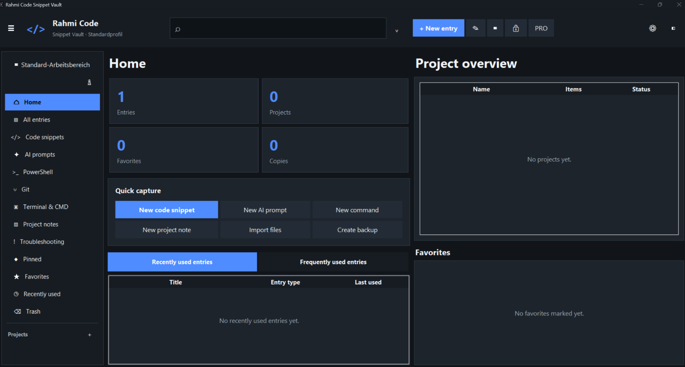
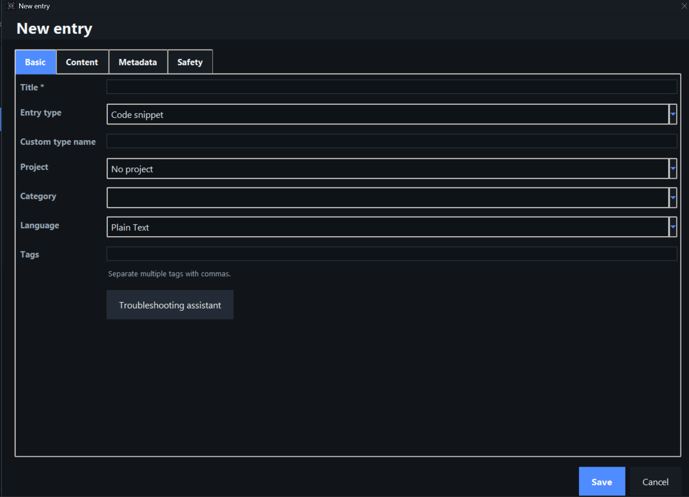
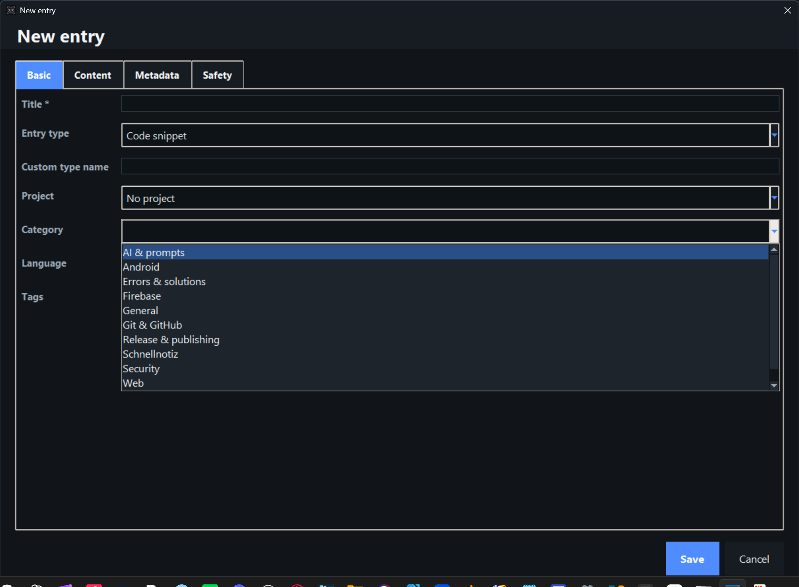

# Rahmi Code Snippet Vault

**Offline Windows desktop app for developers, creators and power users.**  
**Lokale Windows-Desktop-App für Entwickler, Kreative und Power-User.**

---

## English

Rahmi Code Snippet Vault helps you organize code snippets, AI prompts, PowerShell commands, Git commands, terminal commands, troubleshooting notes, project notes, API examples, links and checklists in one modern Windows application.

### Main features

- Fully local and usable without an account
- German and English interface
- Language selection on first start
- Skippable introduction
- Modern popup-based desktop interface
- Code editor with syntax highlighting
- Search, filters, projects, categories and tags
- Favorites, pinned entries and recently used items
- Prompt variables and reusable templates
- Security warnings for dangerous commands
- Import, export, backup and restore
- Trash and version history
- Optional PIN protection
- Light, dark and additional Pro designs
- Stripe-based one-time Pro purchase
- Free version: up to 4 images per entry
- Pro version: up to 10 images per entry
- Windows 10 and Windows 11 support

### Download

Open **Releases** and download:

`Rahmi-Code-Snippet-Vault-Setup-1.6.0.exe`

Then start the installer and follow the setup steps.

> Windows SmartScreen may warn about newly published software that is not yet code-signed. Always download the installer only from this official repository.

---

## Deutsch

Rahmi Code Snippet Vault hilft dabei, Code-Schnipsel, KI-Prompts, PowerShell-Befehle, Git-Befehle, Terminalbefehle, Fehlerlösungen, Projekt-Notizen, API-Beispiele, Links und Checklisten in einer modernen Windows-App zu organisieren.

### Hauptfunktionen

- Vollständig lokal und ohne Konto nutzbar
- Deutsche und englische Oberfläche
- Sprachauswahl beim ersten Start
- Überspringbare Einführung
- Modernes Pop-up-System ohne unnötiges Ganzseiten-Scrollen
- Code-Editor mit Syntaxhervorhebung
- Suche, Filter, Projekte, Kategorien und Tags
- Favoriten, angeheftete und zuletzt verwendete Einträge
- Prompt-Variablen und wiederverwendbare Vorlagen
- Sicherheitswarnungen für gefährliche Befehle
- Import, Export, Sicherung und Wiederherstellung
- Papierkorb und Versionsverlauf
- Optionaler PIN-Schutz
- Helle, dunkle und zusätzliche Pro-Designs
- Einmaliger Pro-Kauf über Stripe
- Free-Version: bis zu 4 Bilder pro Eintrag
- Pro-Version: bis zu 10 Bilder pro Eintrag
- Unterstützung für Windows 10 und Windows 11

### Download

Öffne **Releases** und lade diese Datei herunter:

`Rahmi-Code-Snippet-Vault-Setup-1.6.0.exe`

Danach die Setup-Datei starten und den Installationsschritten folgen.

> Windows SmartScreen kann bei neuer, noch nicht codesignierter Software eine Warnung anzeigen. Lade die Setup-Datei ausschließlich aus diesem offiziellen Repository herunter.

---

## Screenshots

### Security / Sicherheit

### Editor

### Project integrations / Projekt-Integrationen

---

## System requirements / Systemanforderungen

- Windows 10 or Windows 11, 64-bit
- Approximately 250 MB free storage
- Internet connection only for Pro purchase and activation
- All vault content remains stored locally on the PC

---

## Privacy / Datenschutz

The app stores vault content locally on the user's computer. No account is required. Online communication is only used for purchase, activation and purchase restoration of the Pro license.

Die App speichert die Vault-Inhalte lokal auf dem Computer. Es ist kein Konto erforderlich. Eine Online-Verbindung wird nur für Kauf, Aktivierung und Wiederherstellung der Pro-Lizenz verwendet.

---

## Publisher / Herausgeber

**Rahmi Apps**  
Website: https://www.rahmiapps.com
